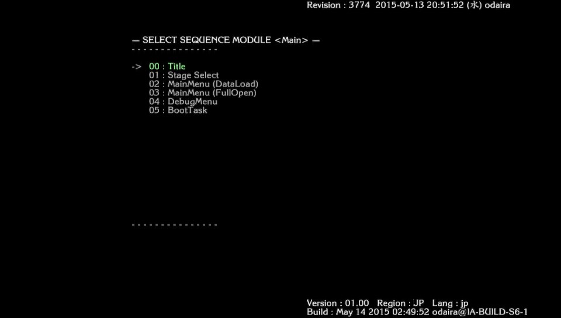
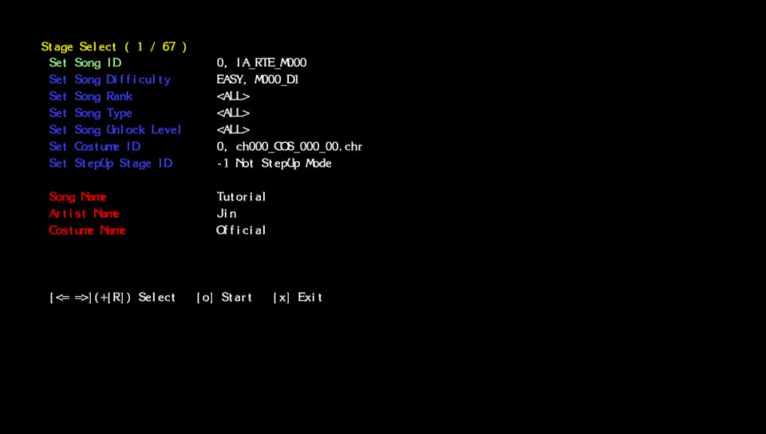

# ColorfulDebug

PlayStation Vita plugin to enable a cut debug menu in `PCSG00355`.

Made by Avellea

# Building
```bash
$ mkdir build
$ cd build
$ cmake ../
$ make
```

# Installing
Place the following at the bottom of `ur0:tai/config.txt`
```
*PCSG00355
ur0:tai/ColorfulDebug.suprx
```

# Images


